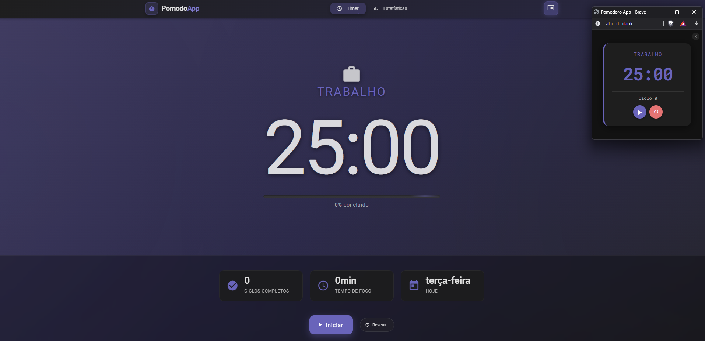

# Pomodoro App

Personal productivity app built with Angular, Node.js, Electron, and SQLite.



---

## Features

- **Timer with Picture-in-Picture Mode**: Stay focused with a timer that can pop out into a resizable, always-on-top window.
- **Dark Mode**: A sleek dark theme for better usability in low-light environments.
- **Statistics Dashboard**: Track your productivity with detailed session statistics.
- **Offline Support**: Fully functional without an internet connection.
- **Cross-Platform**: Runs on Windows, macOS, and Linux.
- **SQLite Integration**: Local database for storing session history.
- **Electron Executable**: A single `.exe` file for easy distribution.

---

## Current Version

**1.0.0 Beta**

---

## How to Build and Run

### Build the Application

1. **Install Dependencies**:
   ```bash
   npm install
   ```

2. **Build the Frontend**:
   Navigate to the `frontend` folder and build the Angular app:
   ```bash
   cd frontend
   npm run build
   ```

3. **Generate the Executable**:
   Return to the root directory and run the Electron Builder:
   ```bash
   cd ..
   npm run build:electron
   ```

4. **Locate the Executable**:
   The generated `.exe` file will be located in the `dist-electron/` folder.

### Run the Application

- To test the app in development mode, use:
  ```bash
  npm start
  ```

- To run the generated executable, navigate to `dist-electron/` and double-click the `.exe` file.

---

## Notes

- The app includes an embedded SQLite database (`pomodoro.db`) for local data storage.
- Ensure the `backend` folder and database file are included during the build process.
- Update the app version in `package.json` before generating a new build.
