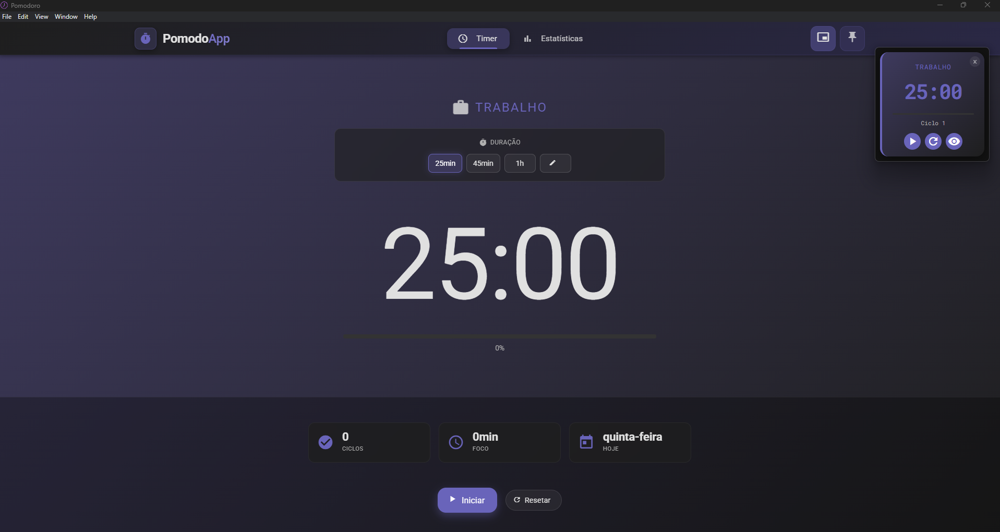
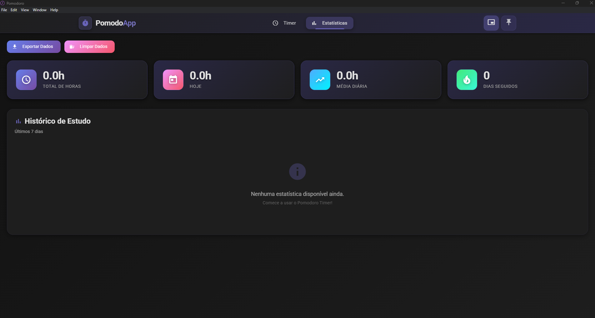

# 🍅 Pomodoro Timer

Personal productivity app built with Angular, Node.js, Electron, and SQLite for Windows.






## 📥 Download & Install

### Ready to use?

**[⬇️ Download the installer from the `releases` folder](./releases/)**

Simply download `Analice Pomodoro Timer-Setup-1.0.0.exe` and run it to install the app on your Windows machine. No additional setup required!

> 💡 **Tip:** You can also use the portable version in `releases/win-unpacked/` - just run the `.exe` directly without installation.


## ✨ Features

- **Timer with Picture-in-Picture Mode**: Stay focused with a timer that can pop out into a resizable, always-on-top window.
- **Customizable Work Duration**: Choose from presets (25min, 45min, 1h) or set your own custom duration.
- **Dark Mode**: A sleek dark theme for better usability in low-light environments.
- **Statistics Dashboard**: Track your productivity with detailed session statistics.
- **Offline Support**: Fully functional without an internet connection.
- **SQLite Integration**: Local database for storing session history.

## 📋 Current Version

**1.0.0 Beta**


## 🔧 Technical Details (For Developers)

### Architecture
- **Frontend**: Angular 20+ with Material Design components
- **Backend**: Node.js with Express and TypeScript
- **Database**: SQLite for local storage
- **Desktop**: Electron with secure context isolation
- **Communication**: IPC (Inter-Process Communication) between Electron main and renderer

### Security Features
- Context isolation enabled
- Node integration disabled in renderer
- Secure preload script for API exposure
- No direct access to Node.js APIs from frontend

### Building from Source

```bash
# Install dependencies
npm run clean-install

# Build the application
npm run build

# The installer will be generated in the releases folder
```

## 📝 Notes

- The app includes an embedded SQLite database (`pomodoro.db`) for local data storage.
- Ensure the `backend` folder, `preload.js`, and database file are included during the build process.
- Update the app version in `package.json` before generating a new build.
- Picture-in-picture features are only available in the Electron version, not in browser mode.

## 📄 License

Free to use for personal productivity. Enjoy! 🎉
